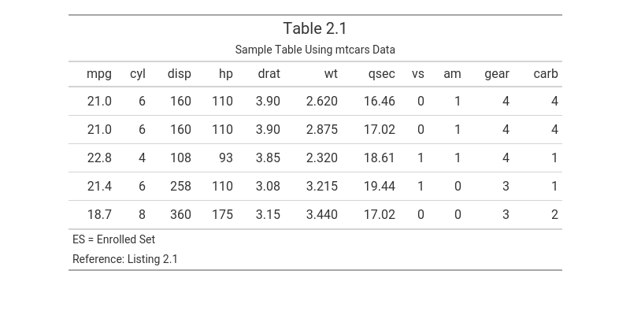

# tflmetaR

## Overview

`tflmetaR` provides a simple interface for retrieving titles, headers,
and footnotes for tables, listings, and figures (TFLs) in clinical study
reports (CSRs) or other formal deliverables from a metadata file.

Best practices in programming recommend separating code from metadata to
improve readability, maintainability, and scalability. However, many R
scripts used for clinical reporting still hardcode TFL annotations
directly in the programs, making codebases difficult to manage and
extend.

`tflmetaR` bridges this gap. Although independent and self-contained, it
is compatible with the
[`{gridify}`](https://CRAN.R-project.org/package=gridify) and integrates
with the [Pharmaverse](https://pharmaverse.org/) ecosystem for
generating submission-ready statistical deliverables.

`tflmetaR` supports two workflows: a concise single-function interface
and a more flexible helper-function workflow.

## Installation

You can install the newest release version from CRAN:

``` r
install.packages("tflmetaR")
```

## Metadata File

The metadata file can be an Excel file (`.xlsx`, `.xls`) or a CSV file
(`.csv`), with standardized column names. Required columns are `PGMNAME`
(program name), `TTL1` (primary title), `FOOT1` (first footnote), and
`SOURCE` (data source). Additional columns for subtitles (`TTL2`,
`TTL3`, …), further footnotes (`FOOT2`, `FOOT3`, …), population
definitions, book mark and bylines are also supported. If your file uses
different column names, use
[`change_colname()`](https://ucb-biopharma.github.io/tflmetaR/reference/change_colname.md)
to remap them to the expected names before passing the file to any
`tflmetaR` function.

## Workflow

The typical workflow is to retrieve annotation metadata from a metadata
file and apply it to a TFL object created with packages such as
[`{gt}`](https://gt.rstudio.com/),
[`{flextable}`](https://davidgohel.github.io/flextable/), or
[`{ggplot2}`](https://ggplot2.tidyverse.org/), or with lower-level grid
tools such as `grob` or `gtable`. Metadata can be retrieved in two ways.

**Option 1: Single-function interface**

Use
[`tflmetaR()`](https://ucb-biopharma.github.io/tflmetaR/reference/tflmetaR.md)
to retrieve the required metadata in a single call:

``` r
path    <- system.file("extdata", "sample_titles.xlsx", package = "tflmetaR")
pgmname <- "t_dm"

title_info <- tflmetaR(
  path,
  by_value         = pgmname,
  annotation       = "TITLE",
  add_footr_tstamp = FALSE
)

footnotes  <- tflmetaR(
  path,
  by_value         = pgmname,
  annotation       = "FOOTR",
  add_footr_tstamp = FALSE
)
```

**Option 2: Helper-function workflow (recommended)**

Read the metadata file once with
[`read_tfile()`](https://ucb-biopharma.github.io/tflmetaR/reference/read_tfile.md),
then retrieve the required metadata with the `get_*()` helper functions.
This avoids repeated I/O operations when annotating multiple fields:

``` r
meta       <- read_tfile(filename = path)
title_info <- get_title(meta, pname = pgmname)
footnotes  <- get_footnote(meta, pname = pgmname, add_footr_tstamp = FALSE)
```

## Example

The following example creates a table using [gt](https://gt.rstudio.com)
and annotates it with titles and footnotes retrieved from a metadata
file using [tflmetaR](https://ucb-biopharma.github.io/tflmetaR/).

``` r
library(tflmetaR)
library(gt)

# Locate example metadata file
path <- system.file("extdata", "sample_titles.xlsx", package = "tflmetaR")
pgmname <- "t_dm"

# Retrieve annotation metadata (Option 2: helper-function workflow)
meta <- read_tfile(filename = path)
titles <- get_title(meta, pname = pgmname)
footnotes <- get_footnote(meta, pname = pgmname, add_footr_tstamp = FALSE)

# Create the annotated gt table
tbl <- mtcars |>
  head(5) |>
  gt::gt() |>
  gt::tab_header(
    title    = titles$TTL1[[1]],
    subtitle = gt::html(titles$TTL2[[1]])
  ) |>
  gt::tab_footnote(footnote = footnotes$FOOT1[[1]]) |>
  gt::tab_footnote(footnote = footnotes$FOOT2[[1]]) |>
  gt::tab_options(table.width = gt::pct(80))
```



Note: Get the image using `gt::gtsave(tbl, "tbl.png")`

## Functions

- [`tflmetaR()`](https://ucb-biopharma.github.io/tflmetaR/reference/tflmetaR.md)
  — Single-call interface for retrieving annotation metadata
- [`read_tfile()`](https://ucb-biopharma.github.io/tflmetaR/reference/read_tfile.md)
  — Read metadata from Excel or CSV
- [`get_title()`](https://ucb-biopharma.github.io/tflmetaR/reference/get_title.md)
  — Retrieve titles and subtitles
- [`get_footnote()`](https://ucb-biopharma.github.io/tflmetaR/reference/get_footnote.md)
  — Retrieve footnotes
- [`get_source()`](https://ucb-biopharma.github.io/tflmetaR/reference/get_source.md)
  — Retrieve data source
- [`get_pop()`](https://ucb-biopharma.github.io/tflmetaR/reference/get_pop.md)
  — Retrieve population
- [`get_byline()`](https://ucb-biopharma.github.io/tflmetaR/reference/get_byline.md)
  — Retrieve bylines
- [`get_pgmname()`](https://ucb-biopharma.github.io/tflmetaR/reference/get_pgmname.md)
  — Retrieve program name
- [`get_bookm()`](https://ucb-biopharma.github.io/tflmetaR/reference/get_bookm.md)
  — Retrieve bookmark
- [`get_ulheader()`](https://ucb-biopharma.github.io/tflmetaR/reference/get_ulheader.md)
  — Retrieve upper-left header content
- [`get_urheader()`](https://ucb-biopharma.github.io/tflmetaR/reference/get_urheader.md)
  — Retrieve upper-right header content
- [`change_colname()`](https://ucb-biopharma.github.io/tflmetaR/reference/change_colname.md)
  — Standardize column names in the metadata file

## Related Packages

`tflmetaR` is designed to work alongside:

- [`{gridify}`](https://CRAN.R-project.org/package=gridify) — for layout
  and rendering annotated TFLs
- [Pharmaverse](https://pharmaverse.org/) — a curated collection of R
  packages for clinical reporting

## Getting Help

For more information please visit the following vignettes:

- **Table Example**
  [`vignette("table-example", package = "tflmetaR")`](https://ucb-biopharma.github.io/tflmetaR/articles/table-example.md) -
  Using `tflmetaR` with `gt` for Professional Tables.
- **Figure Example**
  [`vignette("f_km", package = "tflmetaR")`](https://ucb-biopharma.github.io/tflmetaR/articles/f_km.md) -
  Creating Kaplan-Meier Survival Plots with `tflmetaR` and `gridify`.

## Acknowledgments

Along with the authors and contributors, thanks to the following people
for their support:

Alberto Montironi, Maciej Nasinski
